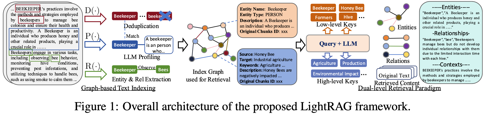
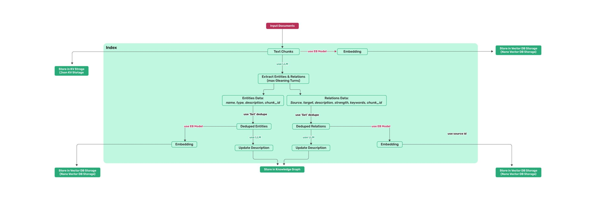
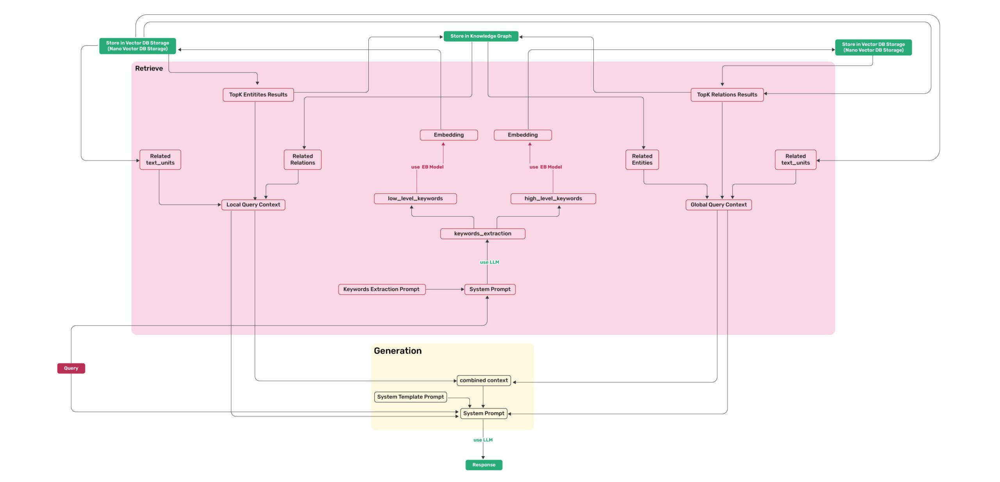

## Tips
```
$env:OLLAMA_HOST="0.0.0.0"
ollama list
```


## Thinking

RAG? Structure? Vector?

> LightRAG的目标: Graph的深度 + Vector的速度



左边, 是其的"存法"--也就是基于图的索引构建
右边, 是其的"找法"--一个非常有创意的双层检索机制'





### 基于图的文本索引构建
- 01
Recognition识别
利用LLM从文本块识别实体（V）和关系（s）
- 02
Profiling画像
为每个节点/关系生成Key-ValuePair·Key：实体名/关系名
Value:文本摘要 
- 03
Deduplication去重
合并不同文档中的相同实体，减少图谱几余


### 为什么需要"双层检索"
#### SpecificQueries 
具体问题
"谁写了《傲慢与偏见》？”
需要精确定位实体，聚焦单一知识点进行回答。
#### AbstractQueries 
抽象问题
"人工智能如何影响现代教育？”
需要跨越多个实体的宏观主题理解与综合分析。

#### LightRAG策略
+ Low-level针对具体实体
+ High-level针对宏观关系，并行检索实现全面覆盖

#### 双层检索范式实现细节
- QueryKeywordExtraction 
使用LLM从查询中提取两组关键词：
    - LocalKeywords
      - 实体级精确词(比如具体的实体名，去图谱里找具体的节点)
    - GlobalKeywords
      - 主题级概念词(比如概念、主题，去匹配图谱里的关系摘要)
- KeywordMatching
通过向量检索匹配图谱中的Key,快速定位相关节点与关系。
- ContextIntegration
收集相邻节点和关系的文本描述，构建丰富的生成上下文。


### 新增文档
新文挡进来了？没关系，直接走一遍索引流程，生成一个小图

- 独立处理
  - 新文档Dnew独立执行 Indexing流程, 构建一个小的graph
- 图谱合并
  - 生成的子图直接与原图取并集

> 无需重构整个图谱结构，计算成本最小化
> 关键发现：即使在大规模语料库上，LightRAG不仅保持深度，反而在多样性上表现更优，因为High-level检索抓取了更多关联主题。

