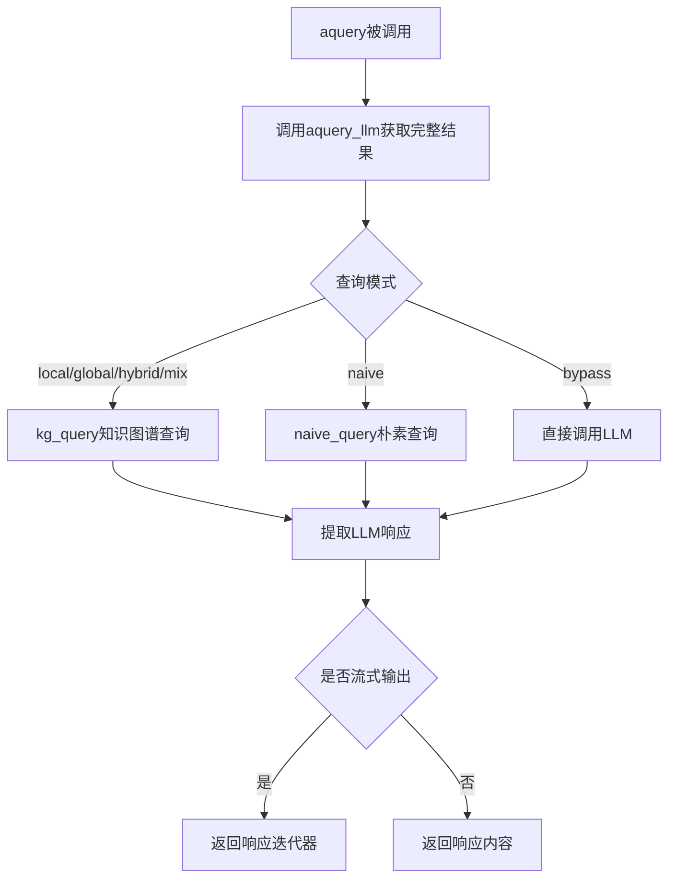
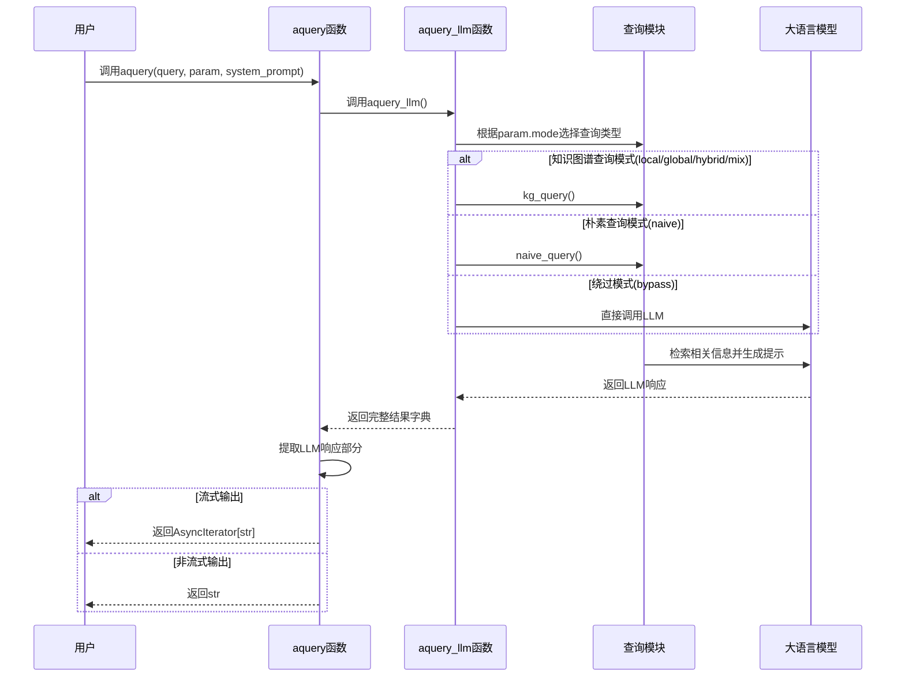

我会帮你分析`aquery`函数的功能和作用。首先，让我查看完整的函数定义以便更好地理解。

现在我已经了解了`aquery`函数的功能和作用，让我为您分析并绘制相应的图表。

## aquery 函数功能分析

`aquery`是LightRAG库中的一个异步查询函数，它是整个系统的核心接口之一。让我总结一下它的主要功能和工作流程：

### 主要功能

1. **异步查询接口**：`aquery`是一个异步函数，用于执行查询操作，支持多种查询模式。
2. **向后兼容包装器**：正如函数文档所述，它是`aquery_llm`函数的包装器，保持向后兼容性，只返回LLM响应内容。
3. **多模式查询支持**：支持多种查询模式，包括：
   - [local](..\lightrag\api\routers\ollama_api.py#L19-L19)：关注上下文相关的本地信息
   - `global`：利用全局知识
   - [hybrid](..\lightrag\api\routers\ollama_api.py#L21-L21)：结合本地和全局检索方法
   - [naive](..\lightrag\api\routers\ollama_api.py#L18-L18)：执行基本搜索，不使用高级技术
   - [mix](..\lightrag\api\routers\ollama_api.py#L22-L22)：集成知识图谱和向量检索
   - [bypass](..\lightrag\api\routers\ollama_api.py#L23-L23)：跳过检索，直接使用LLM

### 工作流程

### 时序图

### 详细说明

1. **参数说明**：
   - [query](..\lightrag\api\routers\query_routes.py#L16-L19)：用户查询字符串
   - `param`：查询参数对象（QueryParam），控制查询的行为模式和其他选项
   - `system_prompt`：可选的系统提示词

2. **核心逻辑**：
   - 调用`aquery_llm`函数执行实际的查询操作，获取完整的结构化结果
   - 从完整结果中提取LLM响应部分，保持向后兼容性
   - 根据是否启用流式输出返回相应类型的响应

3. **查询模式处理**：
   - 对于[local](..\lightrag\api\routers\ollama_api.py#L19-L19)、`global`、[hybrid](..\lightrag\api\routers\ollama_api.py#L21-L21)、[mix](..\lightrag\api\routers\ollama_api.py#L22-L22)模式，使用[kg_query](..\lightrag\operate.py#L3012-L3219)进行知识图谱查询
   - 对于[naive](..\lightrag\api\routers\ollama_api.py#L18-L18)模式，使用[naive_query](..\lightrag\operate.py#L4754-L4998)进行简单向量检索
   - 对于[bypass](..\lightrag\api\routers\ollama_api.py#L23-L23)模式，直接调用LLM，跳过检索步骤

这种设计使得`aquery`既保持了向后兼容性，又提供了现代化的完整查询API（通过`aquery_llm`），用户可以根据需要选择使用哪个接口。