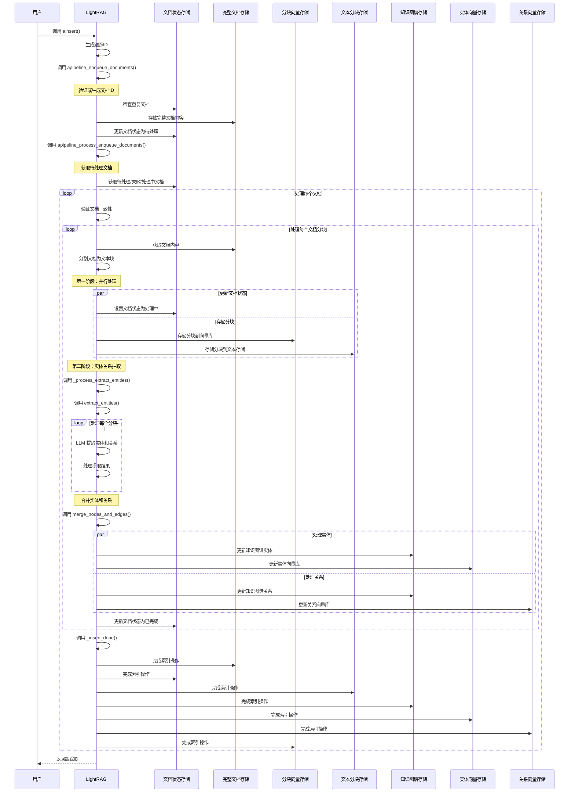
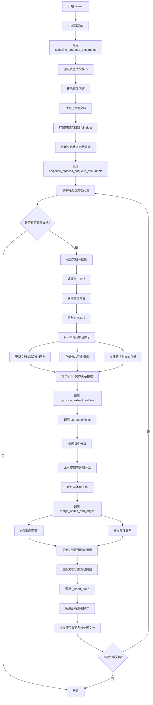

基于我对 LightRAG 中 `ainsert` 方法及相关函数的分析，我现在为你绘制时序图和流程图来展示其内部逻辑。

## 时序图

## 流程图

## 主要组件说明

### 1. 文档预处理阶段
- **文档去重**：通过文档ID和内容摘要进行重复检测
- **状态追踪**：使用 `doc_status` 跟踪每个文档的处理状态（待处理、处理中、已完成、失败）

### 2. 文档分块处理
- **文本分割**：将长文档分割成适当大小的文本块
- **并行处理**：第一阶段并行执行多个存储操作

### 3. 实体关系抽取
- **LLM提取**：使用大型语言模型从文本块中提取实体和关系
- **结果优化**：通过多次采样（gleaning）提高提取质量

### 4. 数据合并与存储
- **两阶段合并**：先处理所有实体，再处理所有关系
- **并发控制**：使用信号量和锁机制控制并发度
- **数据一致性**：确保知识图谱和向量数据库同步更新

### 5. 状态管理
- **管道状态**：跟踪整个处理管道的状态，防止并发冲突
- **错误处理**：完善的异常处理和状态回滚机制

整个 `ainsert` 流程设计得非常完善，具备良好的并发处理能力、错误恢复能力和状态管理能力，能够高效地处理大量文档的插入和处理任务。